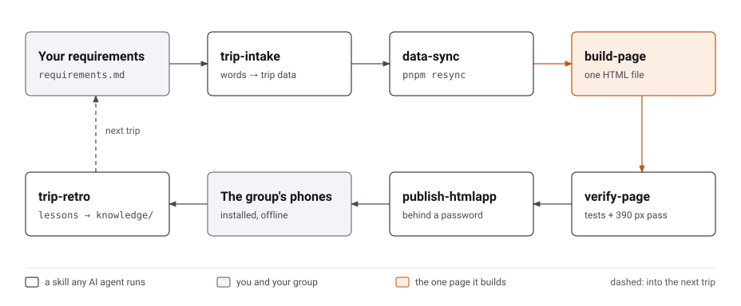

# RelaxJer

_Malaysian for "just relax": family trips at a comfortable pace, with the planning done for you._

RelaxJer plans a family trip with an AI agent and builds it into **one self-contained page**. The group opens it on
their phones, installs it to the home screen, and uses it offline. Each day has a timeline with fixed times that never
move, and every group cost shows a per-person share in the home currency. You get food, drinks, rest spots and toilets
near each stop, and a map with an offline transit planner. The page runs in two UI languages plus the destination's
own.

> **Status: pre-alpha.** The engine has moved in from the first trip (Taipei, 2026) and is being generalised; see
> [`memory-bank/story-index.md`](memory-bank/story-index.md).

## How a trip becomes a page

<picture>
  <source media="(prefers-color-scheme: dark)" srcset="site/assets/flow-dark.svg">
  
</picture>

Each box is a skill any AI agent can run: Claude Code, Codex, Cursor or Gemini CLI. They live in
[`.agents/skills/`](.agents/README.md), and [`AGENTS.md`](AGENTS.md) is where an agent starts. Tell your agent about
the trip in your own words, and it takes it from there, stopping to ask before anything is published.

## Plan a trip

```sh
git clone https://github.com/KennethWKZ/relaxjer && cd relaxjer
corepack enable && pnpm install     # Node 24; also wires the git hooks (needs gitleaks: brew install gitleaks)
```

1. **Google Maps (recommended):** set up your own keys with [`guides/google-maps.md`](guides/google-maps.md). It takes
   about 20 minutes, and a family trip stays within Google's free monthly allowance. You can skip it: the page falls
   back to a free map.
2. **Describe the trip** to your agent: dates, flights, who's coming (seniors?), hotels, what's booked, what you'd
   love. It writes `trips/<slug>/`, which is gitignored and never committed.
3. **Refresh, build, check:** `pnpm resync --trip trips/<slug> --write`, then
   `pnpm build --trip trips/<slug> --keys ~/.config/relaxjer/google.json`, then the tests and a look on your phone.
4. **Publish behind a password** (ht-ml.app), and share the link in your group chat.

### Google Maps or the free map?

|                           | Free map (MapLibre + OpenStreetMap) | Google Maps (your own keys)           |
| ------------------------- | ----------------------------------- | ------------------------------------- |
| Map                       | Clean, community detail             | The map your group already uses       |
| Hours, ratings, photos    | Only what's in your plan            | Live on every place                   |
| Search                    | Your trip's places                  | Plus Google search when adding a stop |
| Walking and transit times | Your plan's times                   | Filled in by the data refresh         |
| Cost and setup            | Free, nothing to set up             | Free for a family trip; ~20 min setup |

The full comparison, the costs, the guardrails and Google's terms are in [`guides/google-maps.md`](guides/google-maps.md).

## Contribute

```sh
pnpm test          # tier 0: hygiene, agent config, memory-bank, trip contract, units (~1 s)
pnpm test:e2e      # the page in Chromium + WebKit at 390 px and desktop
pnpm verify        # lint + format check + tier 0 + pipeline tests (what CI runs)
pnpm build --trip examples/demo-trip   # the synthetic demo trip
```

| Path                   | What                                                                                                   |
| ---------------------- | ------------------------------------------------------------------------------------------------------ |
| `engine/`              | Page engine and single-file build                                                                      |
| `destinations/<cc>/`   | Country packs: time zone, currency, languages, tax refund, entry rules; city adapters under `regions/` |
| `pipeline/`            | Data refresh: Google first, OpenStreetMap fallback, weather, images                                    |
| `examples/demo-trip/`  | A synthetic trip that tests and docs run on                                                            |
| `trips/`               | Your real trips. Gitignored; never committed                                                           |
| `tests/`               | Hygiene, agent config, trip contract, units, Playwright characterisation, the release gate             |
| `knowledge/`           | Lessons learned across trips and countries                                                             |
| `memory-bank/`         | Project context, standards, decisions (ADRs) and the story index                                       |
| `.agents/`, `.claude/` | Skills for any agent; Claude Code's agents, rules and hooks                                            |
| `guides/`              | How-to for planners                                                                                    |
| `site/`                | The landing page on GitHub Pages                                                                       |

Every decision and its trade-offs: [`memory-bank/standards/decision-index.md`](memory-bank/standards/decision-index.md).
The trip page's design system: [`DESIGN.md`](DESIGN.md), and who it's for: [`PRODUCT.md`](PRODUCT.md).

## Hosting

GitHub Pages hosts only the project's landing page. Pages sites are public, so never put a real trip there. Host your
trip page behind a password (ht-ml.app, for example), because it carries hotels, flights and names.

## Licence

[MIT](LICENSE). Vendored design skills keep their own licences: [`.agents/THIRD_PARTY_NOTICES.md`](.agents/THIRD_PARTY_NOTICES.md).
